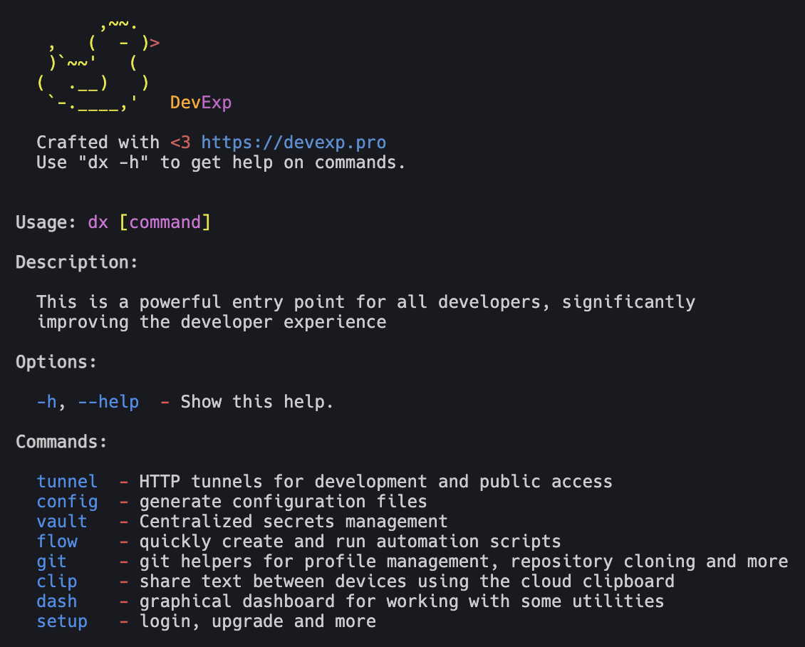

| Welcome to DevExp, your developer experience toolkit! 🚀



# About

**DevExp (or simply dx)** is a cloud-native command-line platform that consolidates essential developer tools — tunneling, secrets, git, databases, LLMs, automation — into a cohesive CLI-first experience. Born from years of hands-on software engineering, dx eliminates tool fragmentation and context switching, helping developers focus, build, and ship faster.

**The Problem**
Modern developers waste countless hours switching between tools, managing secrets, rewriting workflows, and dealing with repetitive setup.
Each new tool adds friction — dx turns that friction into flow.

**The Solution**
A modular, scriptable CLI ecosystem where everything just works — tunneling, deployments, workflows, secrets, LLMs — with one consistent interface, across local and cloud.

Inspired by the elegance of Unix philosophy, the modularity of Terraform, and the power of DevEx thinking.

---

_**✅ Already included in early prototypes:**_
- 🌐 Tunnel: HTTP tunnel management
- 🧑‍💻 Git: Git profile switching and management
- 🔐 Vault: Environment variable & secret storage
- ⚙️ Flow: Process & workflow automation

_**✅ Coming Soon:**_
- Hyper: Deno process/isolates manager
- DB: CLI DB manager via turso.tech
- LLM: Unified interface to local/cloud LLMs
- ALS: Cloud alias store for reusable commands
- Term: Web-based CLI termina

Our mission is to bring together the essential tools developers use daily, into
a single connected ecosystem — replacing dozens of fragmented apps, cloud
services, and a trillion subscriptions (yes, we’re looking at you, subscription
hell).

---

_**📢 Stay updated and join our community**_

We’re actively developing `dx` in the open, and we’d love your feedback,
support, and ideas.

- 💬 **Join us on Telegram**: [t.me/devexppro](https://t.me/devexppro)
- 💸 **Support the project**: Send USDT (TRC20) to
  `TNor9ovj5HDkLJqpyUkze6MMNsM8xDfBTR`

Every contribution — code, ideas, or funding — helps us build a better developer
experience for everyone.

🛠 Built with ❤️ by developers, for developers.

---

- [About](#about)
- [📖 Documentation](#-documentation)
  - [🚀 Installation](#-installation)
    - [Production Version](#production-version)
    - [Development Version](#development-version)
  - [🛠 Tools Manuals](#-tools-manuals)
- [License for DEVEXP CLI](#license-for-devexp-cli)

---
# 📖 Documentation

## 🚀 Installation

### Production Version
Install the stable production version:
```sh
curl -fsSL https://devexp.pro/install.sh | sh
```

### Development Version
For testing the latest changes, new features, and improvements:
```sh
curl -fsSL https://devexp.pro/install-develop.sh | sh
```
---

## 🛠 Tools Manuals

- **[Tunnel](./source/tools/tunnel/MAN.md)** — HTTP tunnels for development and
  public access.
- **[Clip](./source/tools/clip/MAN.md)** — Store text in the cloud clipboard.
- **[Git](./source/tools/git/MAN.md)** — Git helpers for profile management,
  repository cloning, and more.
- **[Vault](./source/tools/vault/MAN.md)** — Centralized secrets management.
- **[Flow](./source/tools/flow/MAN.md)** — Quickly create and run automation
  scripts.

---

📌 Stay productive with DevExp! 🚀

# [License for DEVEXP CLI](./LICENSE)
